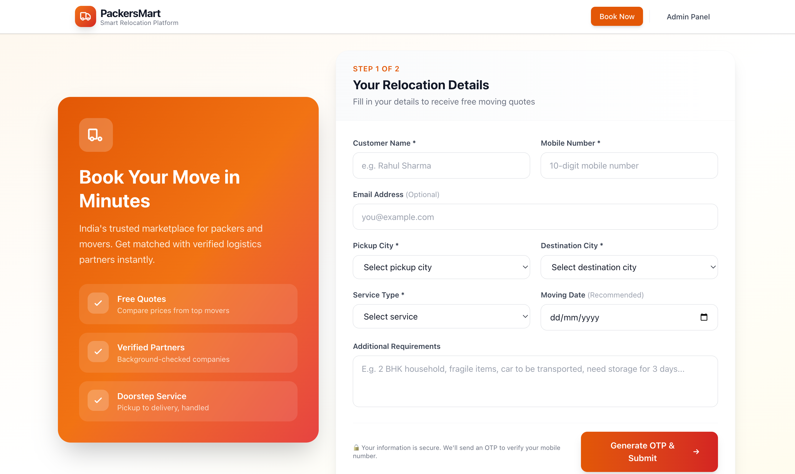
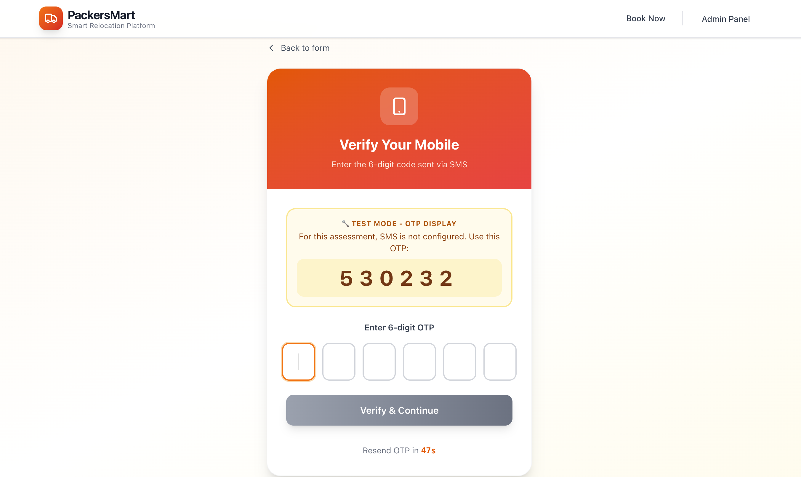
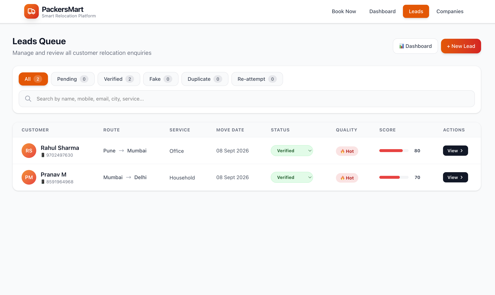
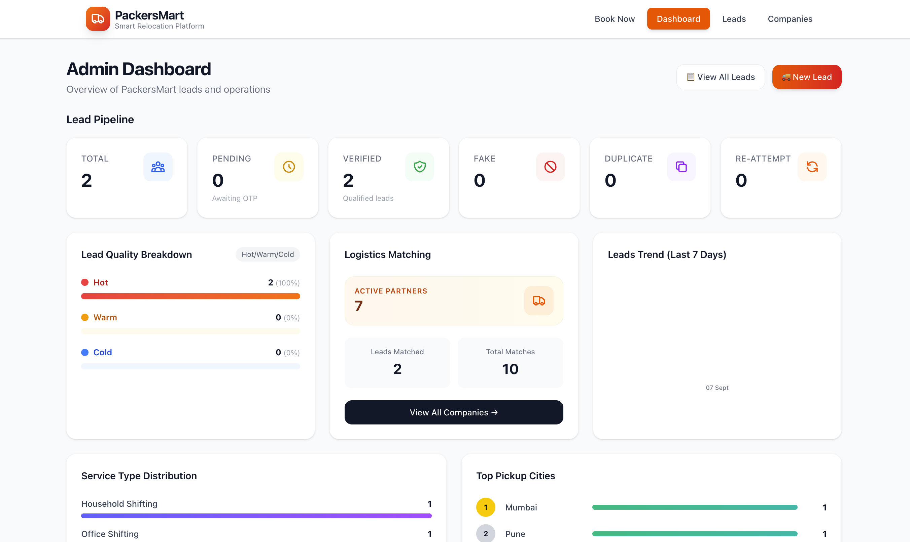
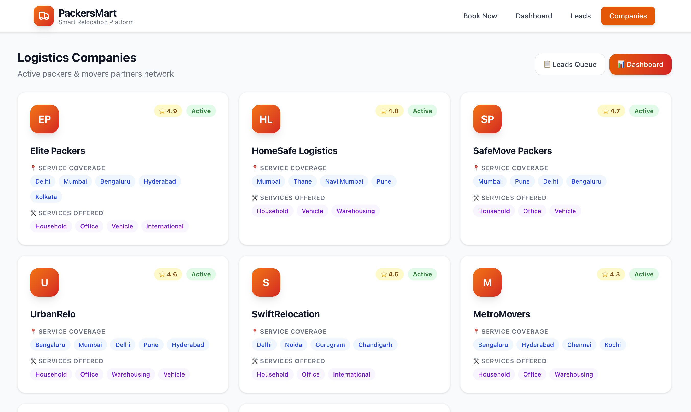

# 🚚 PackersMart MVP — Lead to Booking Platform

A full-stack MVP implementing the PackersMart lead-to-booking workflow for the 1-Day Developer Assessment.

**Core Flow:** Customer Lead Form → OTP Verification → Verified Lead → Admin Queue → Lead Quality Score → Logistics Company Matching → Live Dashboard

---

## 📸 Application Screenshots

> Screenshots saved for submission. Place PNG files in a `screenshots/` folder at the project root if linking locally, or upload to a cloud bucket and replace URLs. Below are the descriptive captions for each taken image.

### 1️⃣ Customer Lead Registration Form

*Responsive 2-column hero + form layout with 8 fields and live frontend validation.*

### 2️⃣ OTP Verification Screen

*6-digit auto-advancing OTP inputs with resend timer and test-mode OTP display banner.*

### 3️⃣ Admin Lead Queue

*Status filter pills, global search, inline status dropdowns, Hot/Warm quality badges, and score progress bars.*

### 4️⃣ Admin Dashboard & Statistics

*6 pipeline stat cards + Hot/Warm/Cold breakdown + Logistics matching summary + 7-day trend + Service breakdown + Top pickup cities (all data live from MySQL database — zero hardcoding).*

### 5️⃣ Logistics Companies Network

*8 seeded packers & movers partners with coverage tags, offered-service pills, and ⭐ ratings. Includes scoring/matching explainer card.*

---

## 🛠️ Technology Stack

| Layer | Technology |
|-------|-----------|
| **Frontend** | React 19 • React Router 6.26 • Vite 8 • Tailwind CSS 4 |
| **Backend**  | Node.js 20 • Express 5 (ES Modules) • MVC Architecture |
| **Database** | MySQL 8 (mysql2/promise pool) — 4 relational tables, FKs, indexes |
| **API**      | REST • JSON • 9 endpoints • Parameterized SQL (no ORM) |

---

## 📁 Project Structure (MVC)

```
Project/
├── backend/src/
│   ├── server.js                     Express entry + startup (test DB conn, init schema, seed)
│   ├── config/db.js                  mysql2 pool + CREATE TABLE IF NOT EXISTS + seed 8 companies
│   ├── middleware/validation.js      validateLeadBody() + VALID_STATUSES enum
│   ├── models/                       {lead, otp, company}Model.js — pure SQL parameterized
│   ├── controllers/                  leadCtrl (score, match, otp) + dashboardCtrl (counts)
│   └── routes/                       leadRoutes.js + dashboardRoutes.js
└── frontend/src/components/          LeadForm, OTPVerification, Dashboard, LeadsTable, LeadDetail, Companies
```

---

## 🚀 Setup Instructions

### Prerequisites
- **Node.js 18+** (20+ recommended)
- **MySQL 8** running locally (MySQL Workbench) with an empty schema named `packersmart`
- npm or yarn

### 1. Configure MySQL Credentials
Edit `backend/.env` to match your MySQL Workbench login:
```env
PORT=5001
DB_HOST=localhost
DB_PORT=3306
DB_USER=root
DB_PASSWORD=your_mysql_password
DB_NAME=packersmart
```

### 2. Backend
```bash
cd backend
npm install
npm run dev
```
✅ On startup, server automatically: tests the connection, creates 4 tables if missing, **seeds 8 companies**, listens on **http://localhost:5001**

### 3. Frontend (new terminal)
```bash
cd frontend
npm install
npm run dev
```
Vite serves UI on **http://localhost:5173** and proxies `/api/*` → http://localhost:5001

### 4. Test the End-to-End Flow
1. Go to **http://localhost:5173** → submit the lead form
2. OTP appears in the amber Test-Mode banner (also printed in backend console)
3. Enter OTP → **Verified** ✅ → lead scored, quality assigned, companies matched
4. Use navbar → **Dashboard** / **Leads** / **Companies** to explore

---

## 📡 API Endpoints (9 Total)

| Method | Endpoint | Purpose |
|--------|----------|---------|
| POST   | `/api/leads` | Create lead + generate OTP |
| POST   | `/api/leads/:id/verify-otp` | Verify OTP (correct → status=Verified) |
| POST   | `/api/leads/:id/resend-otp` | Issue new 6-digit OTP |
| GET    | `/api/leads` | All leads (filter via `?status=Verified`) |
| GET    | `/api/leads/:id` | Lead detail + OTP history + matched companies |
| PATCH  | `/api/leads/:id/status` | Update status: Pending / Verified / Fake / Duplicate / Re-attempt |
| GET    | `/api/leads/:id/matching-companies` | Run matching + return scored ranked companies |
| GET    | `/api/dashboard` | Totals • Hot/Warm/Cold • Trend (7d) • Services • Top cities |
| GET    | `/api/companies` | All 8 seeded logistics partners |

---

## 🧠 Business Logic

### Lead Quality Score (0–100) — 8 Weighted Rules
| Rule | Points |
|------|--------|
| Email present | +15 |
| Valid 10-digit mobile | +10 |
| Moving date specified | +15 |
| Detailed requirements (>5 chars) | +10 |
| Premium service (Intl/Vehicle/Warehousing) | +10 |
| Valid customer name (≥3 chars) | +5 |
| Inter-city move (Pickup ≠ Destination) | +15 |
| Move within next 30 days | +10 |

**Classification:** 🔥 **Hot** ≥70 pts • ☀️ **Warm** 45–69 • ❄️ **Cold** <45

### Rule-Based Company Matching (Max 100 pts, threshold ≥55)
| Rule | Points |
|------|--------|
| Pickup city in company coverage | +35 |
| Destination city in coverage | +35 |
| Requested service type offered | +20 |
| Company rating ≥4.5 ⭐ | +10 |
| Company rating 4.0–4.4 ⭐ | +5 |

Matches are saved to `lead_company_matches` table, sorted by score descending (🥇🥈🥉).

---

## 🗄️ Database Schema (4 Relational Tables)

| Table | Key Columns |
|-------|-------------|
| `leads` | id, customer_name, mobile, email, pickup_city, destination_city, service_type, moving_date, status, **lead_score** (0-100), **lead_quality** (Hot/Warm/Cold), created_at |
| `otp_verifications` | id, lead_id FK, 6-digit otp, expires_at (10 min), verified_at |
| `companies` | id, company_name, coverage(CSV cities), service_types(CSV), rating (DECIMAL 2,1), status (Active/Inactive) |
| `lead_company_matches` | id, **UNIQUE(lead_id, company_id)**, match_score, notification_status, FK→leads, FK→companies |

All tables use `FOREIGN KEY ... ON DELETE CASCADE` and performance-tuned indexes. The server auto-creates everything on first startup via `CREATE TABLE IF NOT EXISTS`.

---

## ✅ Assessment Rubric Coverage

✅ Frontend UI/UX & Responsiveness (15%) • ✅ Backend/API (25%) • ✅ Database Design (15%)
✅ Business Logic (20%) • ✅ FE-BE Integration (10%) • ✅ Code Quality (10%) • ✅ Documentation (5%)

---

## 🗄️ Database Design

Tables are auto-created and seeded on first server start. Located at:
`backend/src/packersmart.db`

### Table: `leads`
Stores all customer relocation enquiries.

| Column | Type | Description |
|--------|------|-------------|
| `id` | INTEGER PK | Auto-increment lead ID |
| `customer_name` | TEXT NOT NULL | Customer full name |
| `mobile` | TEXT NOT NULL | 10-digit mobile (digits only) |
| `email` | TEXT NULL | Email address |
| `pickup_city` | TEXT NOT NULL | Source city |
| `destination_city` | TEXT NOT NULL | Target city |
| `service_type` | TEXT NOT NULL | Household / Office / Vehicle / International / Warehousing |
| `moving_date` | TEXT NULL | Planned move date (ISO) |
| `additional_requirements` | TEXT NULL | Free-text notes |
| `status` | TEXT DEFAULT 'Pending' | Pending, Verified, Fake, Duplicate, Re-attempt |
| `lead_score` | INTEGER DEFAULT 0 | 0-100 quality score |
| `lead_quality` | TEXT NULL | Hot / Warm / Cold |
| `created_at` | TEXT | Auto timestamp |

### Table: `otp_verifications`
Stores OTPs with expiry for each lead.

| Column | Type | Description |
|--------|------|-------------|
| `id` | INTEGER PK | |
| `lead_id` | INTEGER FK → leads.id | Related lead (CASCADE delete) |
| `otp` | TEXT NOT NULL | 6-digit OTP |
| `expires_at` | TEXT NOT NULL | ISO expiry time (10 minutes from issue) |
| `verified_at` | TEXT NULL | Verification timestamp, null if unused |

### Table: `companies`
Sample logistics/packers & movers partners. Seeded with 8 companies on first run.

| Column | Type | Description |
|--------|------|-------------|
| `id` | INTEGER PK | |
| `company_name` | TEXT NOT NULL | Company name |
| `coverage` | TEXT NOT NULL | Comma-separated list of served cities |
| `service_types` | TEXT NOT NULL | Comma-separated list of service types |
| `rating` | REAL DEFAULT 0 | 0.0 - 5.0 star rating |
| `status` | TEXT | Active / Inactive |

### Table: `lead_company_matches`
Junction table storing the computed matches between leads and companies.

| Column | Type | Description |
|--------|------|-------------|
| `id` | INTEGER PK | |
| `lead_id` | INTEGER FK → leads.id | |
| `company_id` | INTEGER FK → companies.id | |
| `match_score` | INTEGER DEFAULT 0 | Matching score for this pair |
| `notification_status` | TEXT DEFAULT 'Pending' | Pending / Sent / Seen |
| `created_at` | TEXT | Auto timestamp |
| **UNIQUE** | (lead_id, company_id) | Prevents duplicate matches |

---

## 📡 List of APIs

| Method | Endpoint | Purpose |
|--------|----------|---------|
| `GET` | `/api/health` | Health check |
| `POST` | `/api/leads` | Create a new lead & generate OTP |
| `POST` | `/api/leads/:id/verify-otp` | Verify OTP (correct → status=Verified) |
| `POST` | `/api/leads/:id/resend-otp` | Generate a new OTP for a lead |
| `GET` | `/api/leads` | Fetch all leads (optionally `?status=Verified`) |
| `GET` | `/api/leads/:id` | Get lead details + OTP history + matched companies |
| `PATCH` | `/api/leads/:id/status` | Update lead status (Pending/Verified/Fake/Duplicate/Re-attempt) |
| `GET` | `/api/leads/:id/matching-companies` | Run matching algorithm & return scored companies |
| `GET` | `/api/dashboard` | Dashboard statistics (lead counts, quality, trend, breakdowns) |
| `GET` | `/api/companies` | List all logistics companies |

---

## 🧠 Lead Scoring Logic

The **Lead Quality Score** (0–100) evaluates how "valuable" or "actionable" an enquiry is. Computed on lead creation and re-computed on OTP verification.

| Rule | Points |
|------|--------|
| Valid Email address provided | +15 |
| Valid 10-digit Mobile number | +10 |
| Moving Date explicitly specified | +15 |
| Additional requirements >5 characters | +10 |
| Premium service (International / Vehicle / Warehousing) | +10 |
| Customer name length ≥ 3 characters | +5 |
| Inter-city move (Pickup ≠ Destination) | +15 |
| Moving Date is within the next 30 days | +10 |
| **Maximum** | **100** |

### Quality Classification
- **🔥 HOT** — Score ≥ 70 → High-intent customer, follow up immediately
- **☀️ WARM** — Score 45–69 → Good potential, nurture
- **❄️ COLD** — Score < 45 → Low info / low intent

---

## 🤝 Company Matching Logic

A rule-based matching algorithm scores each active company against a verified lead.

| Rule | Points |
|------|--------|
| Pickup city is in company's coverage list | +35 |
| Destination city is in company's coverage list | +35 |
| Requested service type is offered by company | +20 |
| Company rating ≥ 4.5 ⭐ | +10 |
| Company rating 4.0–4.4 ⭐ | +5 |
| **Maximum** | **100** |

**Threshold:** A company is only considered a match if total score ≥ 55 (ensures minimum coverage overlap + service match).

**Output:** Matches are sorted by match_score descending (highest quality first). Gold/Silver/Bronze medals are shown on the frontend for top 3 matches.

### Example
Lead: Mumbai → Pune, Household shift.
- Company with coverage `Mumbai,Pune,...` + Household service → Score = 35+35+20+(rating bonus) = **90+**
- Company with coverage `Mumbai,Delhi,...` + Household service → Score = 35+0+20+(rating bonus) = **~60** (barely qualifies)
- Company with coverage `Delhi,Noida,...` → Score < 55, excluded

---

## 🔐 Validation Highlights

**Backend (source of truth):**
- Required fields (name, mobile, pickup/destination, service type)
- Mobile: regex validation for 10 digits (auto-strips non-digits)
- Email: regex validation (RFC-inspired) when provided
- Duplicate detection: Same mobile + same cities + same service type within 24 hours → 409 Conflict
- OTP expiry (10 minutes) checked server-side
- OTP already-verified check
- Status enum validation on PATCH endpoint

**Frontend (UX feedback):**
- Real-time field-level validation messages
- Auto-advance OTP digit inputs with Paste support
- Min date for moving date (today onwards)
- Pickup ≠ Destination validation
- Disabled submit until valid

---

## ✅ Core End-to-End Flow

```
Customer Lead Form (/)
       │
       ▼
 POST /api/leads → Validated ✓ → OTP generated (logged in console)
       │
       ▼
 OTP Verification Screen (/verify-otp/:id)
       │
       ▼
 POST /api/leads/:id/verify-otp → Correct OTP
       │
       ▼
 Lead status → Verified • Lead score recalculated • Lead quality set
       │
       ▼
 Matching algorithm runs → Matches saved to lead_company_matches
       │
       ▼
 Admin Leads Queue (/admin/leads) → Review, search, filter, status-change
       │
       ▼
 Lead Detail (/admin/leads/:id) → Full info • Score breakdown • Matched companies
       │
       ▼
 Dashboard (/dashboard) → All stats (live from DB, never hardcoded)
```

---

## 📸 Key Pages to Screenshot

1. **`/`** — Customer lead form (hero + responsive validation)
2. **`/verify-otp/:id`** — OTP screen with test-mode OTP display
3. **`/dashboard`** — Admin dashboard with charts & stat cards
4. **`/admin/leads`** — Leads queue table w/ status dropdowns, quality badges, progress bars
5. **`/admin/leads/:id`** — Lead detail with scoring breakdown & ranked company matches
6. **`/admin/companies`** — Companies grid + scoring/matching explanation card

---

## 📝 Notes
- OTPs are **logged to the backend console** as plain text (requirement: SMS integration not needed; OTP may be displayed/logged for testing). The OTP screen also shows it directly for convenience.
- SQLite DB file is auto-created at `backend/src/packersmart.db`. **Delete this file to reset the demo** (it will be re-created + reseeded on next server start).
- 8 sample companies are seeded on first run (7 active + 1 inactive) covering major Indian metro cities.